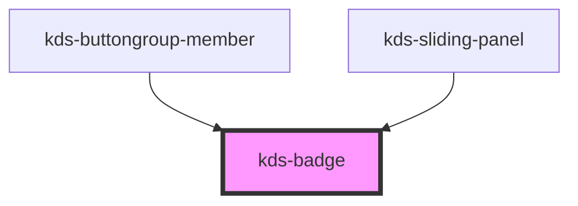

## Properties

| Property | Attribute | Description                      | Type     | Default     |
| -------- | --------- | -------------------------------- | -------- | ----------- |
| `color`  | `color`   | Determines the background color. | `string` | `"brand"`   |
| `count`  | `count`   | The numeric value to display.    | `number` | `undefined` |


## Dependencies

### Used by

 - [kds-buttongroup-member](../buttongroup/kds-buttongroup-member)
 - [kds-sliding-panel](../kds-sliding-panel)

### Graph


----------------------------------------------

*Built with [StencilJS](https://stenciljs.com/)*


```Message { "props" : { "className" : "mb-16" } }
**Note:** For kds-stencil-react consumers, use camel case `KdsBadge` instead of dashed case `kds-badge`.
```

## Standalone

Render a badge inline.
```jsx
<kds-badge class="mr-8" count={9} />
<kds-badge class="mr-8" count={99} />
<kds-badge count={999} />
```

## Colors
Badges can have different color schemes. The available colors are "brand", "inverse", "positive", "negative", "neutral", "special", and "callout".
```jsx
<kds-badge class="mr-8" count={1} color="brand"/>
<span class="bg-brand-800 p-4 mr-4">
	<kds-badge count={2} color="inverse"/>
</span>
<kds-badge class="mr-8" count={3} color="positive"/>
<kds-badge class="mr-8" count={4} color="negative"/>
<kds-badge class="mr-8" count={5} color="neutral"/>
<kds-badge class="mr-8" count={6} color="special"/>
<kds-badge class="mr-8" count={7} color="callout"/>
```

## Badge With Icon

Render a badge pinned to the top right of an `Icon`.
```jsx
<kds-badge count={9}>
  <kds-icon-cart size="utility-l" />
</kds-badge>
```

## Badge With Icon and No Count

Children will be rendered without a badge if `count` is undefined.
```jsx
<kds-badge>
  <kds-icon-cart size="utility-l" />
</kds-badge>
```

## Inverse Badge With Icon

```jsx  { "props": { "style": { "background": "rgb(0, 104, 179)" } } }
<kds-badge class="mr-16" color="inverse" count={9}>
  <kds-icon-cart color="inverse" size="utility-l" />
</kds-badge>
<kds-badge class="mr-16" color="inverse" count={99}>
  <kds-icon-cart color="inverse" size="utility-l" />
</kds-badge>
<kds-badge color="inverse" count={999}>
  <kds-icon-cart color="inverse" size="utility-l" />
</kds-badge>
```
