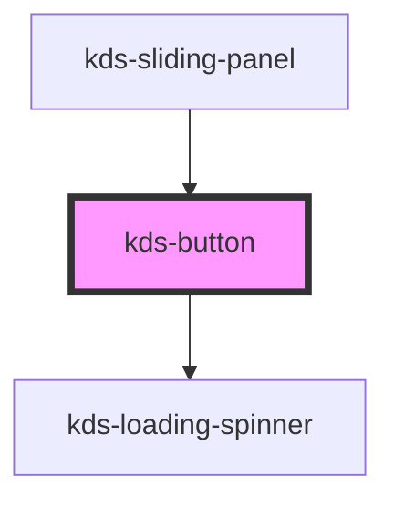

## Properties

| Property         | Attribute        | Description                                                                           | Type                                                                                                                                                                                                                                                                                                         | Default     |
| ---------------- | ---------------- | ------------------------------------------------------------------------------------- | ------------------------------------------------------------------------------------------------------------------------------------------------------------------------------------------------------------------------------------------------------------------------------------------------------------ | ----------- |
| `autofocus`      | `autofocus`      | Takes focus when the form is presented.                                               | `boolean`                                                                                                                                                                                                                                                                                                    | `undefined` |
| `compact`        | `compact`        | Applies the compact size.                                                             | `boolean`                                                                                                                                                                                                                                                                                                    | `false`     |
| `disabled`       | `disabled`       | Disables if present.                                                                  | `boolean`                                                                                                                                                                                                                                                                                                    | `undefined` |
| `form`           | `form`           | Associates the field to a form element.                                               | `string`                                                                                                                                                                                                                                                                                                     | `undefined` |
| `formaction`     | `formaction`     | Overrides the action attribute of the button's form owner. (Submit button type only.) | `string`                                                                                                                                                                                                                                                                                                     | `undefined` |
| `formenctype`    | `formenctype`    | Specifies the type of content that is used to submit. (Submit button type only.)      | `string`                                                                                                                                                                                                                                                                                                     | `undefined` |
| `formmethod`     | `formmethod`     | Specifies the HTTP method used to submit. (Submit button type only.)                  | `string`                                                                                                                                                                                                                                                                                                     | `undefined` |
| `formnovalidate` | `formnovalidate` | Disables form validation. (Submit button type only.)                                  | `boolean`                                                                                                                                                                                                                                                                                                    | `undefined` |
| `formtarget`     | `formtarget`     | Indicates where to display response after submission. (Submit button type only.)      | `string`                                                                                                                                                                                                                                                                                                     | `undefined` |
| `indeterminate`  | `indeterminate`  | Displays a loading spinner as the content of the button if present.                   | `boolean`                                                                                                                                                                                                                                                                                                    | `undefined` |
| `kind`           | `kind`           | Sets the color scheme.                                                                | `"cancel" \| "destructive" \| "destructive-inverse" \| "destructive-secondary" \| "destructive-tertiary" \| "favorable" \| "favorable-inverse" \| "favorable-secondary" \| "favorable-tertiary" \| "primary" \| "primary-inverse" \| "secondary" \| "secondary-inverse" \| "tertiary" \| "tertiary-inverse"` | `"primary"` |
| `name`           | `name`           | Sets the name.                                                                        | `string`                                                                                                                                                                                                                                                                                                     | `undefined` |
| `type`           | `type`           | Sets the button type.                                                                 | `string`                                                                                                                                                                                                                                                                                                     | `undefined` |
| `value`          | `value`          | Contains the current value.                                                           | `number \| string \| string[]`                                                                                                                                                                                                                                                                               | `undefined` |


## Events

| Event   | Description                                                                                                  | Type                             |
| ------- | ------------------------------------------------------------------------------------------------------------ | -------------------------------- |
| `ready` | Emits when the component has been loaded. Event's `detail` contains a reference to the inner button element. | `CustomEvent<HTMLButtonElement>` |


## Methods

### `getNativeElement() => Promise<HTMLButtonElement>`

Returns the native `<button>` element used under the hood.

#### Returns

Type: `Promise<HTMLButtonElement>`


## Dependencies

### Used by

 - [kds-sliding-panel](../kds-sliding-panel)

### Depends on

- [kds-loading-spinner](../kds-loading-spinner)

### Graph


----------------------------------------------

*Built with [StencilJS](https://stenciljs.com/)*


```Message { "props" : { "className" : "mb-16" } }
**Note:** For kds-stencil-react consumers, use camel case `KdsButton` instead of dashed case `kds-button`.
```

## Basic Usage

```Message { "props" : { "className" : "mb-16" } }
**Note:** Since our code examples are rendered in React, we use the onClick prop to wire up our click event listener.
In Angular, you would instead bind your click listener like so: `<kds-button (click)="clickListener()">Test Button</kds-button>`
```

```jsx
<kds-button
  kind="primary"
  name="do"
  value="thing"
  onClick={() => alert("🎉 You did the thing! 🎊")}
>
  Test the kds-button
</kds-button>
```

## Sizes

There are normal and compact sizes available. Just add a `compact` prop for compact buttons when space is limited.

```jsx
<kds-button class="mr-8">Standard</kds-button>
<kds-button compact>Compact</kds-button>
```

## Primary Kind

For primary user actions. Used most in the interface. Only use another style if a button requires less visual weight.

The default style if no `kind` is provided.

```jsx
<kds-button kind="primary">Add to Cart</kds-button>
```

## Primary Inverse Kind

Used when placing a primary button on a dark background. Also used on white backgrounds for icon heavy interfaces and control panels.

```jsx  { "props": { "style": { "background": "rgb(0, 104, 179)" } } }
<kds-button kind="primary-inverse">Add to Cart</kds-button>
```

## Secondary Kind

Used for actions that are of less importance than the primary action. Most often appears next to or beneath a primary button.

```jsx
<kds-button kind="secondary">Add to List</kds-button>
```

## Secondary Inverse Kind

Used when placing a secondary button on a dark background. Also used on white backgrounds for icon heavy interfaces and control panels.

```jsx  { "props": { "style": { "background": "rgb(0, 104, 179)" } } }
<kds-button kind="secondary-inverse">Add to Cart</kds-button>
```

## Tertiary Kind

Used for actions that are of less importance than the secondary action.

```jsx
<kds-button kind="tertiary">Add to List</kds-button>
```

## Tertiary Inverse Kind

Used when placing a tertiary button on a dark background.

```jsx  { "props": { "style": { "background": "rgb(0, 104, 179)" } } }
<kds-button kind="tertiary-inverse">Add to Cart</kds-button>
```

## Cancel Kind

Use when the user needs to cancel an action. Typically used in conjunction with a primary button.

```jsx
<kds-button kind="cancel">Cancel</kds-button>
```

## Favorable Kind

Use when there is a positive action that can be reversed. This is something that will add value to the user.

```jsx
<kds-button kind="favorable">Load Coupon to Card</kds-button>
```

## Favorable Secondary Kind

Use when there is a positive action of less importance than the primary action or for positive actions that require less visual weight.

```jsx
<kds-button kind="favorable-secondary">
  Qualifying Products
</kds-button>
```

## Favorable Tertiary Kind

Use when there is a positive action of less importance than the secondary action.

```jsx
<kds-button kind="favorable-tertiary">
  Qualifying Products
</kds-button>
```

## Favorable Inverse Kind

Used when placing a positive action button on a dark background.

```jsx  { "props": { "style": { "background": "rgb(0, 104, 179)" } } }
<kds-button kind="favorable-inverse">Qualifying Products</kds-button>
```

## Destructive Kind

Use when there is a negative action that cannot be undone. Examples include deleting something or removing something.

```jsx
<kds-button kind="destructive">Delete</kds-button>
```

## Destructive Secondary Kind

Use when there is a negative action of less importance than the primary action or for negative actions that require less visual weight.

```jsx
<kds-button kind="destructive-secondary">
  Remove Coupon from Card
</kds-button>
```

## Destructive Tertiary Kind

Use when there is a negative action of less importance than the secondary action.

```jsx
<kds-button kind="destructive-tertiary">
  Qualifying Products
</kds-button>
```

## Destructive Inverse Kind

Used when placing a negative action button on a dark background.

```jsx  { "props": { "style": { "background": "rgb(0, 104, 179)" } } }
<kds-button kind="destructive-inverse">Qualifying Products</kds-button>
```

## Disabled

Use when the action is temporarily unavailable.

To disable a button just set the standard `disabled` html attribute. It will prevent `click` events from firing at all from the
button. Make sure there's a way for a user to understand why they cannot press the button.

```jsx
<kds-button disabled onClick={() => alert("You will never see me")}>
  Checkout in Express Lane with 78 items
</kds-button>
```

## Indeterminate

Use when async action is taken.

To set a button to indeterminate state just set `indeterminate` to true. It will display a loading spinner indicating an action was taken 
and is still in progress. It will prevent `click` events from firing at all from the button.

```jsx
<kds-button indeterminate onClick={() => alert("You will never see me")}>
  Checkout in Express Lane with 78 items
</kds-button>
```

## Full Width

To achieve a full width button use the `w-full` [utility class](/stencil/components/css-utilities-reference#Margin).

```jsx
<kds-button inner-class="w-full">
  You couldn't hit the broad side of a barn
</kds-button>
```

## Icon Buttons

When a `<kds-icon>` is the only child of `<kds-button>`, the button will render as a circle. The correct `size` prop is automatically applied to the icon component (this will override any `size` prop you may have applied to the child).

> You must add an `aria-label` to attain accessibility requirements

```jsx
<kds-button
  class="mr-8"
  inner-aria-label="Open Account Settings"
>
  <kds-icon-account />
</kds-button>

<kds-button
  class="mr-8"
  inner-aria-label="Open Account Settings"
  compact
>
  <kds-icon-account />
</kds-button>

<span class="inline-block p-8 mr-8" style={{ backgroundColor: 'rgb(0, 104, 179)' }}>
  <kds-button
    class="mr-8"
    kind="primary-inverse"
    inner-aria-label="Add Kroger Plus Card"
  >
    <kds-icon-add-plus-card />
  </kds-button>

  <kds-button
    compact
    kind="primary-inverse"
    inner-aria-label="Add Kroger Plus Card"
  >
    <kds-icon-add-plus-card />
  </kds-button>
</span>

<kds-button
  class="mr-8"
  kind="secondary"
  inner-aria-label="Back to Top"
>
  <kds-icon-chevron-up />
</kds-button>

<kds-button
  class="mr-8"
  compact
  kind="secondary"
  inner-aria-label="Back to Top"
>
  <kds-icon-chevron-up />
</kds-button>

<kds-button
  class="mr-8"
  kind="destructive"
  inner-aria-label="Action is Not Allowed"
>
  <kds-icon-not-available />
</kds-button>

<kds-button
  class="mr-8"
  compact
  kind="destructive"
  inner-aria-label="Action is Not Allowed"
>
  <kds-icon-not-available />
</kds-button>

<kds-button
  class="mr-8"
  kind="destructive-secondary"
  inner-aria-label="Remove item from cart"
>
  <kds-icon-trash />
</kds-button>

<kds-button
  class="mr-8"
  compact
  kind="destructive-secondary"
  inner-aria-label="Remove item from cart"
>
  <kds-icon-trash />
</kds-button>

<kds-button
  class="mr-8"
  kind="favorable"
  inner-aria-label="Add Kroger Plus Card"
>
  <kds-icon-add-plus-card />
</kds-button>

<kds-button
  class="mr-8"
  compact
  kind="favorable"
  inner-aria-label="Add Kroger Plus Card"
>
  <kds-icon-add-plus-card />
</kds-button>

<kds-button
  class="mr-8"
  kind="favorable-secondary"
  inner-aria-label="Add Kroger Plus Card"
>
  <kds-icon-add-plus-card />
</kds-button>

<kds-button
  class="mr-8"
  compact
  kind="favorable-secondary"
  inner-aria-label="Add Kroger Plus Card"
>
  <kds-icon-add-plus-card />
</kds-button>

<kds-button
  class="mr-8"
  disabled
  inner-aria-label="Add Kroger Plus Card"
>
  <kds-icon-add-plus-card />
</kds-button>

<kds-button
  class="mr-8"
  compact
  disabled
  inner-aria-label="Add Kroger Plus Card"
>
  <kds-icon-add-plus-card />
</kds-button>
```

## Inline Icon Buttons

Icons can also appear inline alongside text in a `kds-button`. The correct `size` prop is automatically applied to the icon component (this will override any `size` prop you may have applied to the child).

```jsx
<kds-button
  class="mr-8"
>
  <kds-icon-account></kds-icon-account> Sign up
</kds-button>
<kds-button
  class="mr-8"
  compact
>
  <kds-icon-account></kds-icon-account> Sign up
</kds-button>
```

## Dismissal Button

Implementation of the dismissal button differs from previous examples in that they aren't web components - they're HTML elements styled with CSS. 

To create a properly styled dismissal button, apply the desired style's class(es) to a `<button>` tag.

~~~Message { "props": { "kind": "error", "className": "mb-16" } }
**Note:** The dismissal button classnames have been updated to align with rules established by our blueprints.

Our previous classnames, `.kds-DismissalButton--success`, `.kds-DismissalButton--info`, `.kds-DismissalButton--warning`, and `.kds-DismissalButton--error`, will no longer be supported. If you've used these classes in the past, please update to the newly documented classnames.
~~~

```jsx
<button class="kds-DismissalButton">
  <kds-icon-close size="xs" />
</button>
<button class="kds-DismissalButton kds-DismissalButton--action">
  <kds-icon-close size="xs" />
</button>
<button class="kds-DismissalButton kds-DismissalButton--neutral">
  <kds-icon-close size="xs" />
</button>
<button class="kds-DismissalButton kds-DismissalButton--positive">
  <kds-icon-close size="xs" />
</button>
<button class="kds-DismissalButton kds-DismissalButton--callout">
  <kds-icon-close size="xs" />
</button>
<button class="kds-DismissalButton kds-DismissalButton--negative">
  <kds-icon-close size="xs" />
</button>
<button class="kds-DismissalButton kds-DismissalButton--special">
  <kds-icon-close size="xs" />
</button>
```
