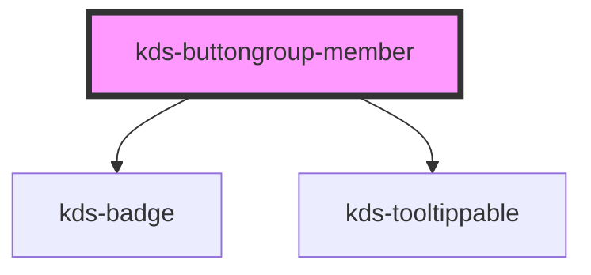

## Properties

| Property                   | Attribute          | Description                                                              | Type                                     | Default            |
| -------------------------- | ------------------ | ------------------------------------------------------------------------ | ---------------------------------------- | ------------------ |
| `badgeValue`               | `badge-value`      | Sets the value of a badge to be rendered on provided icon.               | `number`                                 | `undefined`        |
| `defaultSelected`          | `default-selected` | Sets underlying checkbox or radio button to be selected by default.      | `boolean`                                | `undefined`        |
| `disabled`                 | `disabled`         | Sets member to disabled state if true                                    | `boolean`                                | `false`            |
| `icon`                     | `icon`             | Determines the icon to use.                                              | `string`                                 | `undefined`        |
| `iconPlacement`            | `icon-placement`   | Sets the placement of the icon in a member to the right or left of text. | `"left" \| "right"`                      | `"left"`           |
| `readerLabel` _(required)_ | `reader-label`     | Semantically applies member's aria label with given value.               | `string`                                 | `undefined`        |
| `textLabel`                | `text-label`       | Text to render inside of the member.                                     | `string`                                 | `undefined`        |
| `tooltip`                  | `tooltip`          |                                                                          | `boolean`                                | `false`            |
| `tooltipAlign`             | `tooltip-align`    |                                                                          | `"center" \| "left" \| "right"`          | `"center"`         |
| `tooltipSide`              | `tooltip-side`     |                                                                          | `"bottom" \| "left" \| "right" \| "top"` | `"bottom"`         |
| `tooltipText`              | `tooltip-text`     |                                                                          | `string`                                 | `this.readerLabel` |
| `tooltipType`              | `tooltip-type`     |                                                                          | `"description" \| "label"`               | `"description"`    |

## Methods

### `selectMember() => Promise<void>`

Selects member when called. Only valid for `checkbox` and `radio` group types.

#### Returns

Type: `Promise<void>`

## Dependencies

### Depends on

- [kds-badge](../../kds-badge)
- [kds-tooltippable](../../kds-tooltippable)

### Graph

----------------------------------------------

*Built with [StencilJS](https://stenciljs.com/)*

See examples in [kds-buttongroup](/stencil/components/ButtonGroup#Examples)