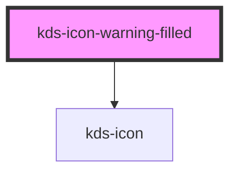

## Properties

| Property | Attribute | Description           | Type                                | Default     |
| -------- | --------- | --------------------- | ----------------------------------- | ----------- |
| `size`   | `size`    | KDS designated sizes. | `"l" \| "m" \| "s" \| "xl" \| "xs"` | `undefined` |


## Dependencies

### Depends on

- [kds-icon](../../kds-icon)

### Graph


----------------------------------------------

*Built with [StencilJS](https://stenciljs.com/)*


```Message { "props" : { "className" : "mb-16" } }
**Note:** For kds-stencil-react consumers, use camel case `KdsIconWarningFilled` instead of dashed case `kds-icon-warning-filled`.
```

```jsx
<kds-icon-warning-filled size="xs"></kds-icon-warning-filled>
<kds-icon-warning-filled size="s"></kds-icon-warning-filled>
<kds-icon-warning-filled size="m"></kds-icon-warning-filled>
<kds-icon-warning-filled size="l"></kds-icon-warning-filled>
<kds-icon-warning-filled size="xl"></kds-icon-warning-filled>
```
