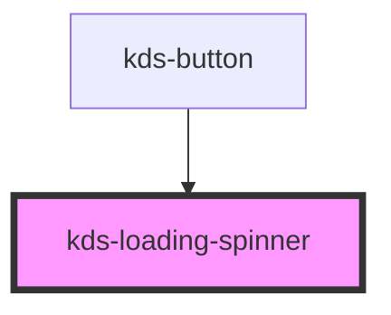

## Properties

| Property  | Attribute | Description                                                                 | Type                        | Default     |
| --------- | --------- | --------------------------------------------------------------------------- | --------------------------- | ----------- |
| `inverse` | `inverse` | Sets a light color scheme for dark backgrounds.                             | `boolean`                   | `undefined` |
| `label`   | `label`   | Indicates what the loading spinner is for. Used for accessibility purposes. | `string`                    | `"loading"` |
| `size`    | `size`    | Controls the dimensions and font-size.                                      | `"l" \| "m" \| "s" \| "xs"` | `"s"`       |


## Dependencies

### Used by

 - [kds-button](../kds-button)

### Graph


----------------------------------------------

*Built with [StencilJS](https://stenciljs.com/)*


```Message { "props" : { "className" : "mb-16" } }
**Note:** For kds-stencil-react consumers, use camel case `KdsLoadingSpinner` instead of dashed case `kds-loading-spinner`.
```

## Basic Usage

By default, a loading spinner has a smaller size and displays a label with the word "loading".

```jsx
<kds-loading-spinner />
```

## Sizes

The `size` prop effects a loading spinner's dimensions and the font-size of its label text. This prop accepts one of four values: `l`, `m`, `s`, and `xs`.

```jsx
<kds-loading-spinner class="mb-16" size="l" />

<kds-loading-spinner class="mb-16" size="m" />

<kds-loading-spinner class="mb-16" />

<kds-loading-spinner size="xs" />
```

## Adding a Custom Label

You can customize the label on your loading spinner by using the `label` prop.

For consistency, the value provided should be lowercase.

```jsx
<kds-loading-spinner label="preparing" />
```

## Removing a Label

If no label is desired, you can pass an empty string to the `label` prop.

It should be noted that choosing this option makes a loading spinner less accessible as it changes the `<label>` tag to a `<span>` tag on the DOM. This should only be used in extreme cases.

```jsx
<kds-loading-spinner label="" />
```

## Inverse Color Option

The `inverse` prop is useful when a loading spinner is needed on dark background. It inverts the color of the label text from black to white, and changes the spinner itself to white.

```jsx { "props": { "style": { "background": "rgb(0, 104, 179)" } } }
<kds-loading-spinner inverse />
```