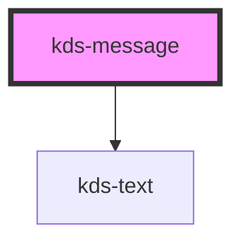

## Properties

| Property   | Attribute  | Description                     | Type                                          | Default  |
| ---------- | ---------- | ------------------------------- | --------------------------------------------- | -------- |
| `closable` | `closable` | Determines if closable.         | `boolean`                                     | `false`  |
| `kind`     | `kind`     | Sets the color scheme and icon. | `"error" \| "info" \| "success" \| "warning"` | `"info"` |


## Events

| Event           | Description                                    | Type               |
| --------------- | ---------------------------------------------- | ------------------ |
| `messageClosed` | An event fired when a user closes the message. | `CustomEvent<any>` |


## Dependencies

### Depends on

- [kds-text](../kds-text)

### Graph


----------------------------------------------

*Built with [StencilJS](https://stenciljs.com/)*


```Message { "props" : { "className" : "mb-16" } }
**Note:** For kds-stencil-react consumers, use camel case `KdsMessage` instead of dashed case `kds-message`.
```

## Kinds

Messages come in four different kinds: `info`, `success`, `warning`, `error`.

If a prop of `kind` is not set, it defaults to an information message.

```jsx
<kds-message kind="info" class="mb-16">
  Your Kroger is open 24 hours.
</kds-message>

<kds-message kind="success" class="mb-16">
  You've added an item to your cart!
</kds-message>

<kds-message kind="warning" class="mb-16">
  You must be at least 21 years old to receive this item.
</kds-message>

<kds-message kind="error" class="mb-16">
  You have entered an incorrect password.
</kds-message>
```

## Group Message

To conform to correct style guidelines, a group of related messages should be wrapped in a `<div>` with a class of `kds-MessageGroup` applied.

```jsx
<div class="kds-MessageGroup">
  <kds-message>
    Cheese on toast paneer.
  </kds-message>
  <kds-message kind="success">
    Danish fontina melted cheese cheesy grin gouda rubber cheese the big cheese cauliflower cheese edam.
  </kds-message>
  <kds-message kind="warning">
    Babybel queso cottage cheese dolcelatte port-salut fromage frais queso goat.
  </kds-message>
  <kds-message kind="error">
    Feta paneer red leicester.
  </kds-message>
</div>
```

## Adding a Link

Adding a custom link makes use of two additional components: [kds-text](/stencil/components/text) and [kds-link](/stencil/components/Link). Nest both within your message component, `<kds-text>` above `<kds-link>` as seen in the example below.

```jsx
<kds-message>
  <kds-text size="s" class="block">
    Your Kroger is open 24 hours.
  </kds-text>
  <kds-link implied href="#">
    Extra Long Link
  </kds-link>
</kds-message>
```

## Closable Messages

Adding the prop `closable` to your message component creates a closable message. This prop accepts boolean values. A closable message will emit a `messageClosed` event and removes it from the DOM.

The following example are three different ways this prop can be added to your component.

```jsx
<kds-message kind="info" class="mb-16" closable>
  Your Kroger is open 24 hours.
</kds-message>

<kds-message kind="success" class="mb-16" closable="true">
  You've added an item to your cart!
</kds-message>

<kds-message kind="warning" class="mb-16" closable="false">
  You must be at least 21 years old to receive this item.
</kds-message>
```

## Accessibility

By default, a message will not announce itself when it appears on screen. If you're presenting a critical message or one which requires immediate action, you may want to adjust this behavior. You can do that by adding `role="alert"` to your message.

In the following example, we show the alert by waiting to render it into the DOM. For other accessible alert examples, see the documentation [here](https://developer.mozilla.org/en-US/docs/Web/Accessibility/ARIA/ARIA_Techniques/Using_the_alert_role#Examples).

```Message { "props": { "kind": "info", "className" : "mb-16"} }
Since the following examples are rendered in React, we're using React-specific implementation. Some parts of the example may not apply to your use case.
```

```jsx
class MessageADAExample extends React.Component {
  constructor() {
    super(this.props)
    this.state = { showError: false }
  }
    
  render() {
    return (
      <div>
        { this.state.showError && 
          <kds-message
            kind="error"
            role="alert"
            class="mb-16"
          >
            You have entered an incorrect password.
          </kds-message>
        }
        <kds-button onClick={() => this.setState({ showError: true }) }>
          Show Error
        </kds-button>
      </div>
    )
  }
}

render(<MessageADAExample />)
```