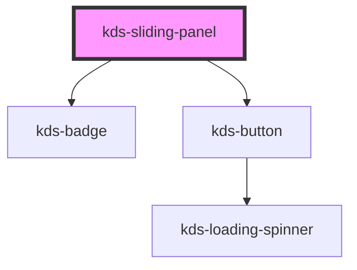

## Properties

| Property                  | Attribute              | Description                                                                           | Type                                           | Default              |
| ------------------------- | ---------------------- | ------------------------------------------------------------------------------------- | ---------------------------------------------- | -------------------- |
| `align`                   | `align`                | Positions to the left or right of content.                                            | `"left" \| "right"`                            | `"left"`             |
| `badgeLabel`              | `badge-label`          | Sets aria label when badge is defined, i.e., "filters selected" or "messages unread". | `string`                                       | `undefined`          |
| `badgeValue`              | `badge-value`          | Determines if badge displayed and what its value is.                                  | `number`                                       | `0`                  |
| `headingLevel`            | `heading-level`        | Defines the heading level in relation to the layout it's being placed.                | `"h1" \| "h2" \| "h3" \| "h4" \| "h5" \| "h6"` | `"h3"`               |
| `hideCollapsedPanel`      | `hide-collapsed-panel` | Applies a hidden attribute to the component if true.                                  | `boolean`                                      | `false`              |
| `icon`                    | `icon`                 | Defines icon.                                                                         | `string`                                       | `"kds-icon-filters"` |
| `open`                    | `open`                 | Determines if panel is open.                                                          | `boolean`                                      | `false`              |
| `overlap`                 | `overlap`              | Applies a fixed position.                                                             | `boolean`                                      | `false`              |
| `panelTitle` _(required)_ | `panel-title`          | Defines title text.                                                                   | `string`                                       | `undefined`          |
| `panelWidth`              | `panel-width`          | Defines the custom width of the open panel in `rem` units.                            | `number`                                       | `undefined`          |


## Events

| Event                 | Description               | Type               |
| --------------------- | ------------------------- | ------------------ |
| `slidingPanelToggled` | Toggles open/close state. | `CustomEvent<any>` |


## Dependencies

### Depends on

- [kds-badge](../kds-badge)
- [kds-button](../kds-button)

### Graph


----------------------------------------------

*Built with [StencilJS](https://stenciljs.com/)*


```Message { "props" : { "className" : "mb-16" } }
**Note:** For kds-stencil-react consumers, use camel case `KdsSlidingPanel` instead of dashed case `kds-sliding-panel`.
```

## Basic Usage

Sliding panel differs from some of our other components in a few ways.

First, you must wrap your component *and* its associated content with an HTML element with the class `kds-SlidingPanelWrapper border border-solid border-default-300` applied. This wrapping container provides additional styling critical to how the component is laid out with its associated content.

Second, this wrapping HTML element should have a *declared min-height* - especially if the sliding panel has a fixed position. The min-height informs the sliding panel how tall it should be and prevents visual jank when opening or closing said component.

```jsx
<div class="kds-SlidingPanelWrapper border border-default-300">
  <kds-sliding-panel 
    class="bg-white" 
    panel-title="Default Sliding Panel"
  >
    <div class="p-16">
      Lorem ipsum, dolor sit amet consectetur adipisicing elit. Cum, ducimus. Obcaecati et eaque vel provident officia modi nihil excepturi, at cupiditate, maxime perferendis? Iusto incidunt doloribus molestias, nesciunt praesentium sed?
    </div>
  </kds-sliding-panel>

  <div class="m-16">
    <p class="kds-Paragraph">Lorem ipsum dolor sit amet consectetur adipisicing elit. Ratione, eos eum perferendis vel amet non optio soluta ipsam corrupti tempore nemo nisi tenetur aperiam alias repudiandae cum nulla voluptatibus iure.</p>
  </div>
</div>
```

## Open by Default

A sliding panel is rendered closed by default. If you want it to render open by default, apply the prop `open` to your sliding panel.

```jsx
<div class="kds-SlidingPanelWrapper border border-default-300">
  <kds-sliding-panel  
    class="bg-white" 
    panel-title="Open Sliding Panel"
    open
  >
    <div class="p-16">
      Lorem ipsum, dolor sit amet consectetur adipisicing elit. Cum, ducimus. Obcaecati et eaque vel provident officia modi nihil excepturi, at cupiditate, maxime perferendis? Iusto incidunt doloribus molestias, nesciunt praesentium sed?
    </div>
  </kds-sliding-panel>

  <div class="m-16">
    <p class="kds-Paragraph">Lorem ipsum dolor sit amet consectetur adipisicing elit. Ratione, eos eum perferendis vel amet non optio soluta ipsam corrupti tempore nemo nisi tenetur aperiam alias repudiandae cum nulla voluptatibus iure.</p>
  </div>
</div>
```

## Semantic Headings

By default, headings are `<h3>` elements. If this level heading doesn't fit with the semantic markup of your document, the prop `heading-level` is available to make the appropriate adjustment. This prop accepts any heading tag.

```jsx
<div class="kds-SlidingPanelWrapper border border-default-300">
  <kds-sliding-panel  
    class="bg-white" 
    panel-title="H2 Heading"
    heading-level="h2"
  >
    <div class="p-16">
      Lorem ipsum, dolor sit amet consectetur adipisicing elit. Cum, ducimus. Obcaecati et eaque vel provident officia modi nihil excepturi, at cupiditate, maxime perferendis? Iusto incidunt doloribus molestias, nesciunt praesentium sed?
    </div>
  </kds-sliding-panel>

  <div class="m-16">
    <p class="kds-Paragraph">Lorem ipsum dolor sit amet consectetur adipisicing elit. Ratione, eos eum perferendis vel amet non optio soluta ipsam corrupti tempore nemo nisi tenetur aperiam alias repudiandae cum nulla voluptatibus iure.</p>
  </div>
</div>
```

## Layout Options

By default, the sliding panel is left-aligned and relatively positioned, but there are options available to change this layout if needed.

### Alignment

To change the alignment of your sliding panel, add the prop `align` to your sliding panel. This prop accepts either `left` or `right`, but is `left` by default.

```jsx
<div class="kds-SlidingPanelWrapper border border-default-300">
  <kds-sliding-panel  
    class="bg-white" 
    panel-title="Right-Aligned Sliding Panel"
    align="right"
  >
    <div class="p-16">
      Lorem ipsum, dolor sit amet consectetur adipisicing elit. Cum, ducimus. Obcaecati et eaque vel provident officia modi nihil excepturi, at cupiditate, maxime perferendis? Iusto incidunt doloribus molestias, nesciunt praesentium sed?
    </div>
  </kds-sliding-panel>

  <div class="m-16">
    <p class="kds-Paragraph">Lorem ipsum dolor sit amet consectetur adipisicing elit. Ratione, eos eum perferendis vel amet non optio soluta ipsam corrupti tempore nemo nisi tenetur aperiam alias repudiandae cum nulla voluptatibus iure.</p>
  </div>
</div>
```

### Positioning

To change the positioning of your sliding panel, add the prop `overlap` to your sliding panel. This will absolutely position your element, enabling it to open "above" your content.

```jsx
<div class="kds-SlidingPanelWrapper border border-default-300" style={{ minHeight: "200px" }}>
  <kds-sliding-panel  
    class="bg-white" 
    panel-title="Fixed Sliding Panel"
    overlap
  >
    <div class="p-16">
      Lorem ipsum, dolor sit amet consectetur adipisicing elit. Cum, ducimus. Obcaecati et eaque vel provident officia modi nihil excepturi, at cupiditate, maxime perferendis? Iusto incidunt doloribus molestias, nesciunt praesentium sed?
    </div>
  </kds-sliding-panel>

  <div class="ml-80 m-16 pl-16">
    <p class="kds-Paragraph">Lorem ipsum dolor sit amet consectetur adipisicing elit. Ratione, eos eum perferendis vel amet non optio soluta ipsam corrupti tempore nemo nisi tenetur aperiam alias repudiandae cum nulla voluptatibus iure.</p>
  </div>
</div>
```

It should also be noted that these props can be combined. So it's wholly possible to create a right-aligned, absolutely positioned sliding panel.

```jsx
<div class="kds-SlidingPanelWrapper border border-default-300" style={{ minHeight: "200px" }}>
  <kds-sliding-panel  
    class="bg-white" 
    panel-title="Fixed Right-Aligned Sliding Panel"
    align="right"
    overlap
  >
    <div class="p-16">
      Lorem ipsum, dolor sit amet consectetur adipisicing elit. Cum, ducimus. Obcaecati et eaque vel provident officia modi nihil excepturi, at cupiditate, maxime perferendis? Iusto incidunt doloribus molestias, nesciunt praesentium sed?
    </div>
  </kds-sliding-panel>

  <div class="mr-80 m-16 pr-16">
    <p class="kds-Paragraph">Lorem ipsum dolor sit amet consectetur adipisicing elit. Ratione, eos eum perferendis vel amet non optio soluta ipsam corrupti tempore nemo nisi tenetur aperiam alias repudiandae cum nulla voluptatibus iure.</p>
  </div>
</div>
```

### Sticky Footer

Because the sliding panel can take any markup as a child, creating custom layouts can be achieved by combining the appropriate markup and styles. Here, we're illustrating a sticky footer using a variety of utility classes offered by KDS.

```jsx
<div class="kds-SlidingPanelWrapper border border-default-300" style={{ minHeight: "300px" }}>
  <kds-sliding-panel  
    class="bg-white" 
    panel-title="Sticky Footer Example"
  >
    <div>
      <div class="p-16">
        <kds-label>
          Name
          <kds-input name="example" />
        </kds-label>
        <div role="radiogroup" class="mt-16">
          <kds-text tag="legend">Income level</kds-text>
          <kds-label class="mt-8">
            <kds-radio name="radioGroupExample" />
            $0 - 40,000
          </kds-label>
          <kds-label class="mt-8">
            <kds-radio name="radioGroupExample" />
            $40,001 - 80,000
          </kds-label>
          <kds-label class="mt-8">
            <kds-radio name="radioGroupExample" />
            $80,001+
          </kds-label>
        </div>
        <kds-label class="mt-16">
          Highest education level
          <kds-select>
            <option>High school diploma</option>
            <option>Associates degree</option>
            <option>Bachelors degree</option>
            <option>Masters degree</option>
            <option>PhD</option>
          </kds-select>
        </kds-label>
      </div>
      <footer class="p-16 bg-default-50 sticky pin-b border-t border-default-300">
        <kds-button kind="primary" class="mr-8">Submit</kds-button>
        <kds-button kind="secondary">Cancel</kds-button>
      </footer>
    </div>
  </kds-sliding-panel>

  <div class="m-16">
    <p class="kds-Paragraph">Lorem ipsum dolor sit amet consectetur adipisicing elit. Ratione, eos eum perferendis vel amet non optio soluta ipsam corrupti tempore nemo nisi tenetur aperiam alias repudiandae cum nulla voluptatibus iure.</p>
  </div>
</div>
```

## Sliding Panel with Badge

Sliding panels accept a `badge-value` prop, which, when given a value greater than 0, will display on your closed sliding panel.

`badge-label` must be defined to give users context to what the badge value means. It answers the question, Badge value of what? When setting a `badge-label` think of it as the other half of the sentence: `badge-value` + `badge-label`.

```jsx
<div class="kds-SlidingPanelWrapper border border-default-300">
  <kds-sliding-panel  
    class="bg-white" 
    panel-title="Badge Sliding Panel"
    badge-value="99"
    badge-label="unread messages"
  >
    <div class="p-16">
      Lorem ipsum, dolor sit amet consectetur adipisicing elit. Cum, ducimus. Obcaecati et eaque vel provident officia modi nihil excepturi, at cupiditate, maxime perferendis? Iusto incidunt doloribus molestias, nesciunt praesentium sed?
    </div>
  </kds-sliding-panel>

  <div class="m-16">
    <p class="kds-Paragraph">Lorem ipsum dolor sit amet consectetur adipisicing elit. Ratione, eos eum perferendis vel amet non optio soluta ipsam corrupti tempore nemo nisi tenetur aperiam alias repudiandae cum nulla voluptatibus iure.</p>
  </div>
</div>
```

## Custom Options

Other options exist to customize the look of your sliding panel. `panel-width` and/or `icon` props can be applied, changing the width and icon of your panel, respectively.

It should be noted that the width of your panel will render in `rem` units. To calculate your desired width you must know the base font-size of your application. For most, it's 16px.

So if you want a panel that's 200px wide and your base font-size is 10px, divide 200px / 10px to get 20rems.

```jsx
<div class="kds-SlidingPanelWrapper border border-default-300">
  <kds-sliding-panel  
    class="bg-white" 
    panel-title="Custom Sliding Panel"
    panel-width="10"
    icon="kds-icon-coupons"
  >
    <div class="p-16">
      Lorem ipsum, dolor sit amet consectetur adipisicing elit. Cum, ducimus. Obcaecati et eaque vel provident officia modi nihil excepturi, at cupiditate, maxime perferendis? Iusto incidunt doloribus molestias, nesciunt praesentium sed?
    </div>
  </kds-sliding-panel>

  <div class="m-16">
    <p class="kds-Paragraph">Lorem ipsum dolor sit amet consectetur adipisicing elit. Ratione, eos eum perferendis vel amet non optio soluta ipsam corrupti tempore nemo nisi tenetur aperiam alias repudiandae cum nulla voluptatibus iure.</p>
  </div>
</div>
```
