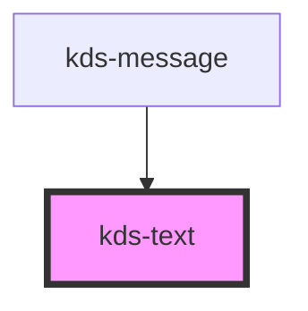

## Properties

| Property | Attribute | Description            | Type                        | Default  |
| -------- | --------- | ---------------------- | --------------------------- | -------- |
| `bold`   | `bold`    | Increases font weight. | `boolean`                   | `false`  |
| `size`   | `size`    | Sets font size.        | `"l" \| "m" \| "s" \| "xs"` | `"m"`    |
| `tag`    | `tag`     | Changes the HTML tag.  | `string`                    | `"span"` |


## Events

| Event   | Description                         | Type               |
| ------- | ----------------------------------- | ------------------ |
| `ready` | Emits when the component is loaded. | `CustomEvent<any>` |


## Methods

### `getNativeElement() => Promise<HTMLElement>`

Returns the native `<span>` element used under the hood.

#### Returns

Type: `Promise<HTMLElement>`


## Dependencies

### Used by

 - [kds-message](../kds-message)

### Graph


----------------------------------------------

*Built with [StencilJS](https://stenciljs.com/)*


```Message { "props" : { "className" : "mb-16" } }
**Note:** For kds-stencil-react consumers, use camel case `KdsText` instead of dashed case `kds-text`.
```

## Sizes

Use `size` to change a text's size. This prop accepts one of four values: `l`, `m`, `s`, and `xs`.

```jsx
<kds-text size="l">Large, 1rem / 16px | </kds-text>
<kds-text size="m">Medium, 0.844rem / 13.5px | </kds-text>
<kds-text size="s">Small, 0.75rem / 12px | </kds-text>
<kds-text size="xs">X-Small, 0.625rem / 10px</kds-text>
```

## Bold

Use the `bold` prop to increase the font-weight.

```jsx
<kds-text size="l" bold>
  Bold
</kds-text>
```

## Display Block

Add the `block` [utility class](/stencil/components/css-utilities-reference#Display) to change `<kds-text>` from an inline element to a display element.

```jsx
<kds-text inner-class="block" size="l">Large, 1rem / 16px</kds-text>
<kds-text inner-class="block" size="m">Medium, 0.844rem / 13.5px</kds-text>
<kds-text inner-class="block" size="s">Small, 0.75rem / 12px</kds-text>
<kds-text inner-class="block" size="xs">X-Small, 0.625rem / 10px</kds-text>
```
