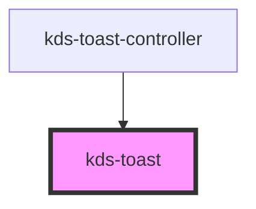

## Properties

| Property  | Attribute | Description            | Type                                          | Default     |
| --------- | --------- | ---------------------- | --------------------------------------------- | ----------- |
| `heading` | `heading` | Sets the heading text. | `string`                                      | `undefined` |
| `kind`    | `kind`    | Sets the color scheme. | `"error" \| "info" \| "success" \| "warning"` | `undefined` |
| `message` | `message` | Sets the body text.    | `string`                                      | `null`      |

## Events

| Event        | Description                                   | Type               |
| ------------ | --------------------------------------------- | ------------------ |
| `ready`      | Emits when the component is loaded.           | `CustomEvent<any>` |
| `toastClose` | Fires when the message is closed by the user. | `CustomEvent<any>` |

## Dependencies

### Used by

 - [kds-toast-controller](../kds-toast-controller)

### Graph

----------------------------------------------

*Built with [StencilJS](https://stenciljs.com/)*

## Basic Usage

The creation, display and dismissal of a toast message requires the use of `kds-toast-controller`.

Please refer to the documentation on [kds-toast-controller](/stencil/components/ToastController) for more details.
