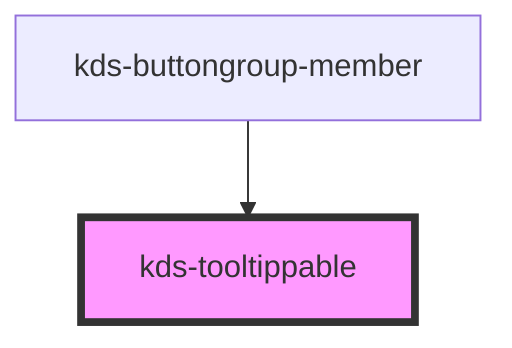

## Properties

| Property                   | Attribute      | Description                                                                                                         | Type                                     | Default     |
| -------------------------- | -------------- | ------------------------------------------------------------------------------------------------------------------- | ---------------------------------------- | ----------- |
| `align`                    | `align`        | Sets how the tooltip will align with it's attached element.                                                         | `"center" \| "left" \| "right"`          | `"center"`  |
| `side`                     | `side`         | Sets the side a tooltip will appear relative to it's attached element.                                              | `"bottom" \| "left" \| "right" \| "top"` | `"bottom"`  |
| `tooltipText`              | `tooltip-text` | Sets the text that will render inside the tooltip.                                                                  | `string`                                 | `undefined` |
| `tooltipType` _(required)_ | `tooltip-type` | Determines if the tooltip acts as a label or description of the tooltipped element and sets proper aria attributes. | `"description" \| "label"`               | `undefined` |


## Dependencies

### Used by

 - [kds-buttongroup-member](../buttongroup/kds-buttongroup-member)

### Graph


----------------------------------------------

*Built with [StencilJS](https://stenciljs.com/)*


```Message { "props" : { "className" : "mb-16" } }
**Note:** For kds-stencil-react consumers, use camel case `KdsTooltippable` instead of dashed case `kds-tooltippable`.
```

## Accessibility
The `kds-tooltippable` component will automatically set an `aria-describedby` or `aria-labelledby` attribute on the element being tooltipped. The id used is set on the tooltip content container with the class: `.kds-Tooltip-content`. If you are tooltipping a custom component, you may need to manually set the `aria-*` attribute on the appropriate element inside your component.

## Applying a Tooltip
You can apply a tooltip to an element by passing that element as a child to the `kds-tooltippable` component. Then, set the tooltip text via the `tooltipText` prop (or `tooltip-text` attribute).

The tooltip will appear below the element and centered by default.

```Message { "props" : { "className" : "mb-16" } }
**Note:** Except for links, when applying tooltips to plain text ensure the text is focusable, has a dotted underline, and italic style.
```

```jsx
<kds-tooltippable
  tooltip-text="Special offers like this remain on your card until they expire."
>
  <span 
    class="italic"
    style={{ 'text-decoration': 'underline dotted' }}
    tabindex="0" 
  >
    Why can't I remove this offer?
  </span>
</kds-tooltippable>
```

## Tooltip with Rich Text
If you want to provide rich text to the tooltip, you can instead provide the attribute `slot="tooltipText"` to any element you want to be inserted inside the tooltip.

```jsx
<kds-tooltippable side="bottom">
  <span 
    className="italic"
    style={{ 'text-decoration': 'underline dotted' }}
    tabindex="0"
  >
    Rich text?
  </span>
  <span slot="tooltipText">
    This <strong>Tooltip</strong> contains <i>rich text</i>.
  </span>
</kds-tooltippable>
```

## Tooltip Positioning
A tooltip can be positioned using the `side` and `align` props, allowing consumers to determine how the best positioning for a tooltip based on the layout of their view.

```Message { "props" : { "className" : "mb-16" } }
**Note:** Tooltips that appear on the left or right side of their element can only be center aligned. Alignment only applies to Tooltips that appear on the top or bottom side of their element.
```

### Tooltip with Short Form Text
```jsx { "props": { "style": { "overflow": "auto" } } }
<section class="text-center">
  <kds-tooltippable side="bottom" align="left" tooltip-text="Bottom Left">
    <kds-button>
      ToolTipped Bottom Left
    </kds-button>
  </kds-tooltippable>
  <kds-tooltippable side="bottom" align="center" tooltip-text="Bottom Center">
    <kds-button>
      ToolTipped Bottom Center
    </kds-button>
  </kds-tooltippable>
  <kds-tooltippable class="mb-32" side="bottom" align="right" tooltip-text="Bottom Right">
    <kds-button>
      ToolTipped Bottom Right
    </kds-button>
  </kds-tooltippable>
  <br />
  <kds-tooltippable class="mb-32" side="top" align="left" tooltip-text="Top Left">
    <kds-button>
      ToolTipped Top Left
    </kds-button>
  </kds-tooltippable>
  <kds-tooltippable class="mb-32" side="top" align="center" tooltip-text="Top Center">
    <kds-button>
      ToolTipped Top Center
    </kds-button>
  </kds-tooltippable>
  <kds-tooltippable class="mb-32" side="top" align="right" tooltip-text="Top Right">
    <kds-button>
      ToolTipped Top Right
    </kds-button>
  </kds-tooltippable>
  <br />
  <kds-tooltippable class="mb-32" side="left" tooltip-text="Left">
    <kds-button>
      ToolTipped Left
    </kds-button>
  </kds-tooltippable>
  <br />
  <kds-tooltippable class="mb-32" side="right" tooltip-text="Right">
    <kds-button>
      ToolTipped Right
    </kds-button>
  </kds-tooltippable>
</section>
```

### Tooltip with Long Form Text

```jsx { "props": { "style": { "overflow": "auto" } } }
<section class="text-center">
  <kds-tooltippable side="bottom" align="left" tooltip-text="This tooltip appears on the bottom and left aligned.">
    <kds-button>
      ToolTipped Bottom Left
    </kds-button>
  </kds-tooltippable>
  <kds-tooltippable side="bottom" align="center" tooltip-text="This tooltip appears on the bottom and centered.">
    <kds-button>
      ToolTipped Bottom Center
    </kds-button>
  </kds-tooltippable>
  <kds-tooltippable class="mb-32" side="bottom" align="right" tooltip-text="This tooltip appears on the bottom and right aligned.">
    <kds-button>
      ToolTipped Bottom Right
    </kds-button>
  </kds-tooltippable>
  <br />
  <kds-tooltippable class="mb-32" side="top" align="left" tooltip-text="This tooltip appears on the top and left aligned.">
    <kds-button>
      ToolTipped Top Left
    </kds-button>
  </kds-tooltippable>
  <kds-tooltippable class="mb-32" side="top" align="center" tooltip-text="This tooltip appears on the top and centered.">
    <kds-button>
      ToolTipped Top Center
    </kds-button>
  </kds-tooltippable>
  <kds-tooltippable class="mb-32" side="top" align="right" tooltip-text="This tooltip appears on the top and right aligned.">
    <kds-button>
      ToolTipped Top Right
    </kds-button>
  </kds-tooltippable>
  <br />
  <kds-tooltippable class="mb-32" side="left" tooltip-text="This tooltip appears on the left.">
    <kds-button>
      ToolTipped Left
    </kds-button>
  </kds-tooltippable>
  <br />
  <kds-tooltippable class="mb-32" side="right" tooltip-text="This tooltip appears on the right.">
    <kds-button>
      ToolTipped Right
    </kds-button>
  </kds-tooltippable>
</section>
```

## Tooltip Repositioning

When a user hovers over or focuses on a tooltipped element, a check is performed to see if the tooltip will appear outside of the bounds of the browser window. If the check passes, we attempt to reposition the tooltip so that it will fully appear within the window.

```Message { "props" : { "className" : "mb-16" } }
**Note:** An IntersectionObserver is used to perform the repositioning logic and therefore will not function within IE11. If your application targets IE11 and would like the tooltip to reposition, consider adding the [Intersection Observer Polyfill](https://github.com/w3c/IntersectionObserver/tree/master/polyfill) to your application.
```

The following are the rules for repositioning:

1. When a tooltip is on the *top side* or *bottom side* of an element: 
    - and the left of the tooltip is off the viewport:
      - align the tooltip to the *left* of the element.
    - and the right of the tooltip is off the viewport:
      - align the tooltip to the *right* of the element.
2. When a tooltip is on the *top side* of an element and the top of the tooltip is off the viewport:
    - change the placement to the *bottom side* of the element.
3. When a tooltip is on the *bottom side* of an element and the bottom of the tooltip is off the viewport:
    - change the placement to the *top side* of the element.
4. When a tooltip is on the *right side* of an element and the right of the tooltip is off the viewport:
    - change the placement to the *left side* of the element.
5. When a tooltip is on the *left side* of an element and the left of the tooltip is off the viewport:
    - change the placement to the *right side* of the element.
